# Fisheries management

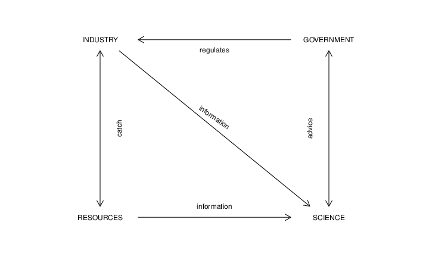{height=80%}\

# Goals of fisheries management

## Goals

- Sustainable benefits from harvesting
- Conserve stock(s) productivity
- Minimise impacts on ecosystem

## Requirements

- Set of clear management objectives
- Indication of proper harvest and/or stock level
- Means to monitor status
- Measures to control fishing on advice

# Challenges of fisheries management

- Objectives set to be operational
- Trade-offs between short and long term
- Monitoring impact to ecosystem
- Quantifiying uncertainty in status andn dynamics
- Making decisions acknowledging risks

# How to deal with all this? MSE

> Assessing the consequences of a range of different management strategies to determine which one will be the most appropriate to meet the operational objectives of the fishery.

## Goals

1. Robustness against uncertainty.
2. Compare relative performance of alternative MPs.
3. Simulation-test MPs under a wide(r) range of realities.

# Where does this come from?

- IWC {width=15%}\
- New Management Procedure

\centering\includegraphics[width=0.40\textwidth]{figs/nmp}

- Revised Management Procedure
- Catch Limit Algorithm (CLA)

# IWC: Uncertainties in RMP[¹]

- Alternative population models.
- Initial population size from 5-99% of unexploited (initial, pre-whaling).
- Rates of productivity and chnages over time.
- Uncertainty and bias in the estimated population size.
- Frequencies of abundance surveys (every 1, 5 or 10 years).
- Changes in carrying capacity (climate change, habitat degragation).
- Errors in historic records of catches.
- Occurrence of catastrophes simulating unpredictable (major disease).
- Uncertainty about stock structure.

[¹]: https://iwc.int/rmp2, https://doi.org/10.1093/icesjms/fsm035

# MSE now

- IWC Revised Management Procedure
- South African pelagics
- Australian fisheries
- CCSBT
- STECF Management Plans
- ICES Management Plans
- ICCAT, IOTC
- Add your own ...

# A model of the fishery system

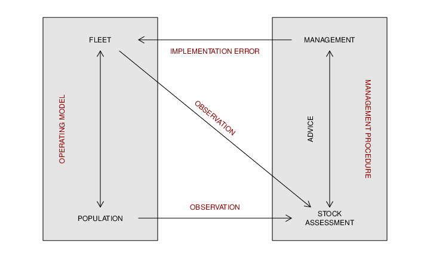{height=80%}\

# Six steps to MSE [^1]

- Define and agree on **objectives** & **limits**
- Identify appropriate **Management Procedures**
- Define a set of **Operating Models**
- Conduct **simulations**
- Summarize **performance**
- Select best **MP**

[^1]: Punt, A. E., Butterworth, D. S., de, Moor, C. L., De Oliveira, J. A. and Haddon, M. (2016), Management strategy evaluation: best practices. Fish Fish, 17: 303-334. doi:10.1111/faf.12104

# Define **objectives** & **limits**

- IOTC: target=$B_{MSY}$, limit=$0.40\cdot B_{MSY}$, also $P(Green) > 60\%$, over next 20 
years.

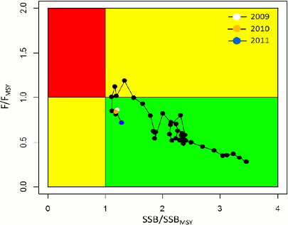{width=40%}\ 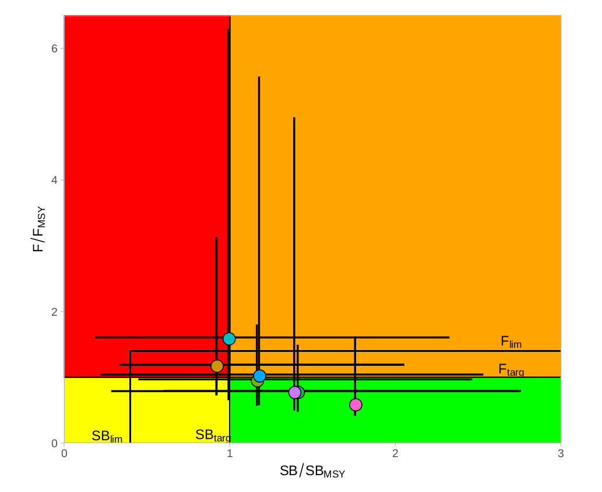{width=40%}\

# Identify **Management Procedures**

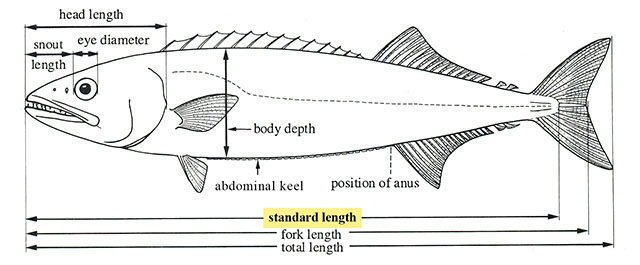{height=18%}\ {height=25%}\ 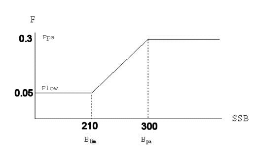{height=25%}\

# Define **Operating Models**

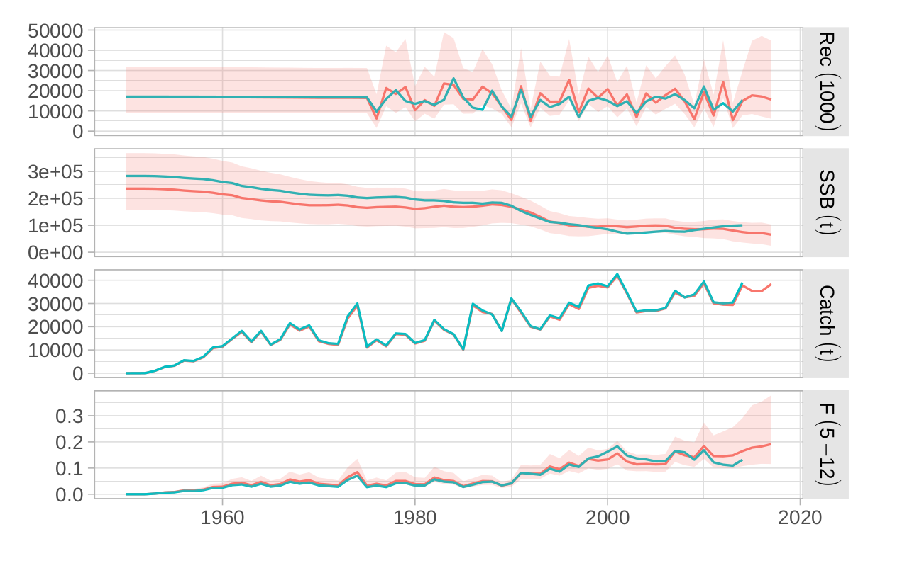{width=95%}\

# Conduct **simulations**

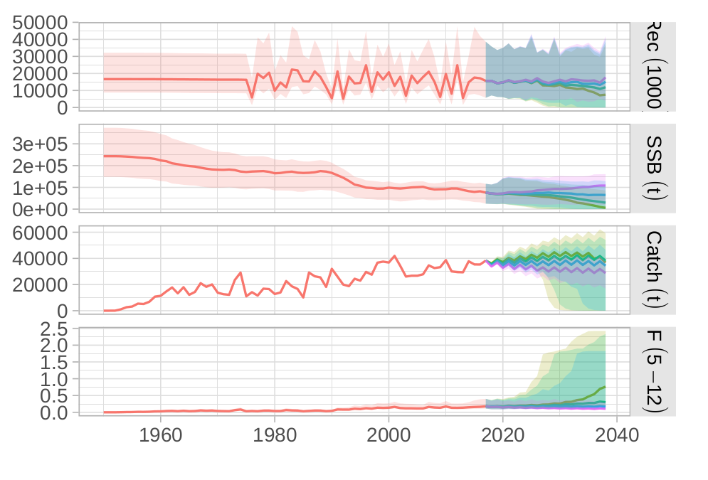{width=95%}\

# Summarize **performance**

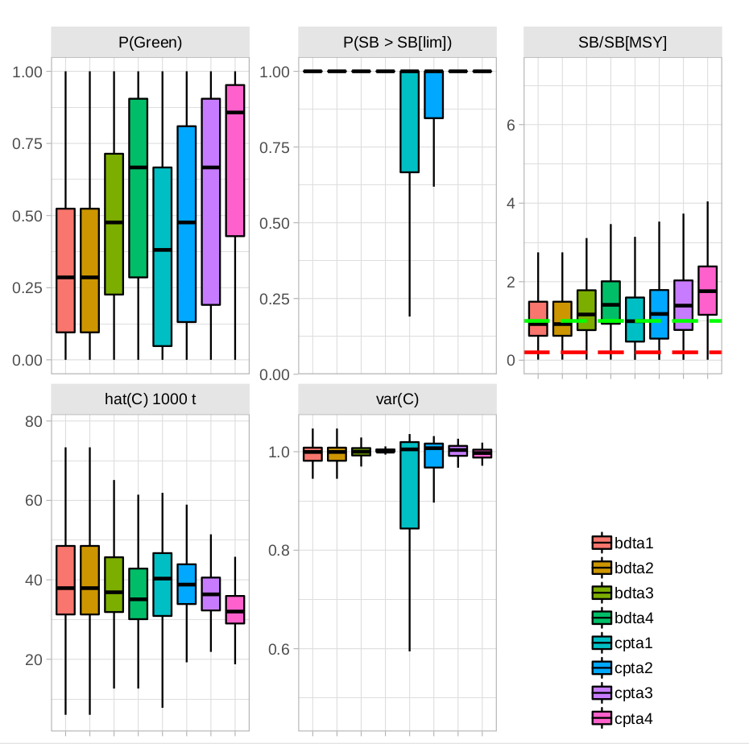{width=50%}\ 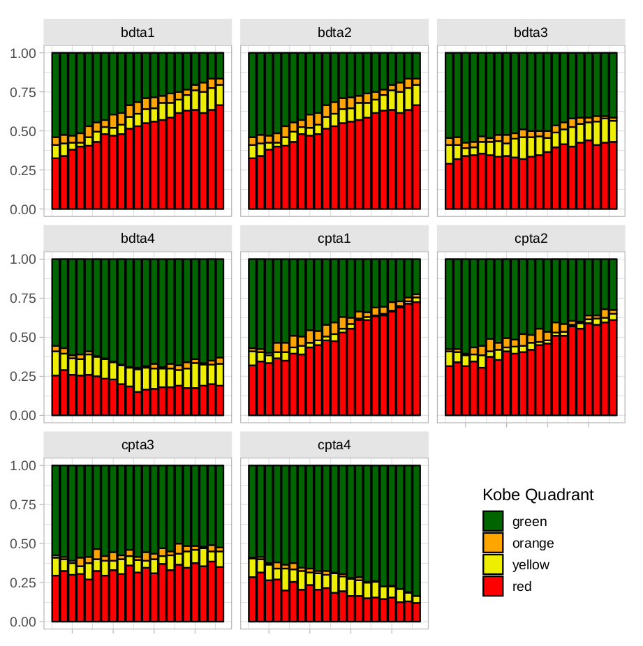{width=50%}\

# Select best **MP**

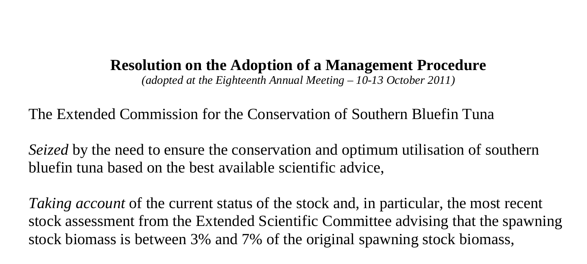{width=95%}\
 
# What are the advantages?

- Avoid being driven by yearly variability in SA
- Long-term trade-offs made clear
- Less haggling
- No *wrong* best assessment
- Default decision
- Risk on board
- Consistent with PA
- Interaction across the table

# And disadvantages?

- Results dependent on model (as usual)
- Lengthy development (less and less so)
- Data still essential (indeed)
- Overly rigid (up to you)
- Autopilot (exceptional circumstances)

